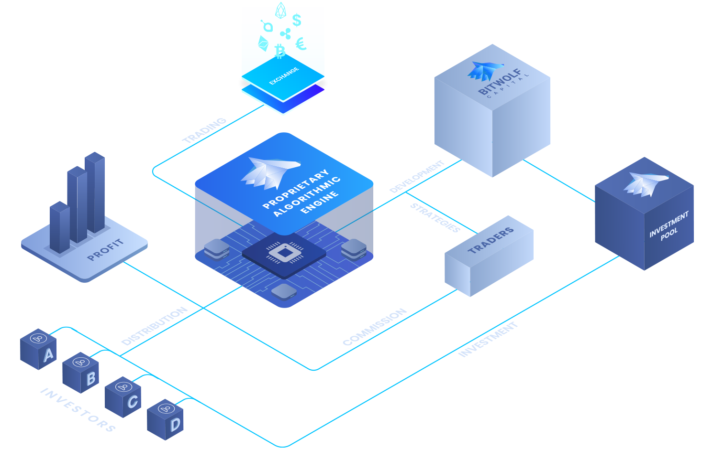

# Case Study : Bitwolf Capital

## What is it

BitWolf is a blockchain investment platform where Bitwolf blockchain experts, traders, quants and developers convert proven and winning trading strategies into sophisticated algorithms to execute trades on crypto exchanges. These strategies are build in-house according to various metrics, technical and fundamental analysis, profitability and sustainability.

Simple and efficient, BitWolf’s platform offers to customers an investor dashboard to monitor, deposit and withdraw their crypto assets. BitWolf applies various manual and automated trading strategies accross a cryptocurrency exchange. The investors have no need to make any actions, trades nor settings, once funds are received by BitWolf Capital, they are managed through multiple algorithmic and manual trading techniques.

All crypto asset balances and profits are displayed in Bitcoin (BTC) and Euros/US Dollars (EUR/USD displayed for information purposes only) on BitWolf’s dedicated investor dashboard where investors can monitor the ongoing performance of their investment and withdraw their crypto assets in one click. The BitWolf Ecosystem gather investors, traders and BitWolf trading, blockchain and computer scientists experts towards one definite purpose: Making profit by creating and executing profitable algorithmic trading strategies while managing the risk.

## Philosophy

Bitwolf's team believes that the asset management industry is on the verge of a new era of monumental changes. In the near future a massive amount of people and companies will be able to safely invest in a range of crypto asset classes without the thresholds of current restrictions in the financial space.

BitWolf investors are able to invest in just one click using our investing platform with a fully automated trading system applying a risk management framework which provides the best and safest environment possible. Humans are great, computers are better (for some other things only !)

## Why this matters

1. Crypto market being open 24/7, delegating responsibily of investing and managing the crypto portfolio can be more rewarding for investors especially for whale investors.

2. Algorithmic trading can capture volatility of the crypto market for efficiently.

3. Machine learning models deployed can allow the trading algorrithms to make better decisions and be able to create profitable strategies.

4. Deploying algorithmic trading programs allows for faster trading speeds as computers are able to process more data than a human can.

## Why this may be interesting

1. Allows to implement multiple ways of trading like leverage, arbritage etc very easily.

2. Algo trading makes markets more liquid by introducing a large volume of trades and orders.

3. Computers are much more faster at calculating and sending instructions and dont suffer from emotions.

4. In established markets such as equities and commodities, algorithmic trading has been dominated by highly sophisticated institutions that have invested heavily in developing proprietary strategies and infrastructure. However, in the nascent cryptocurrency markets, algorithmic trading is becoming more accessible to individual traders and retail investors.

## Resources
1. [White paper](https://bitwolfcapital.com/downloadable/whitepaper.pdf)
2. [Benefits of algo trading](https://hackernoon.com/algorithmic-trading-is-changing-crypto-trading-one-bot-at-a-time-3a1234na)
3. [Interesting view on algo trading](https://hummingbot.io/blog/2019-01-beginner-crypto-trader)