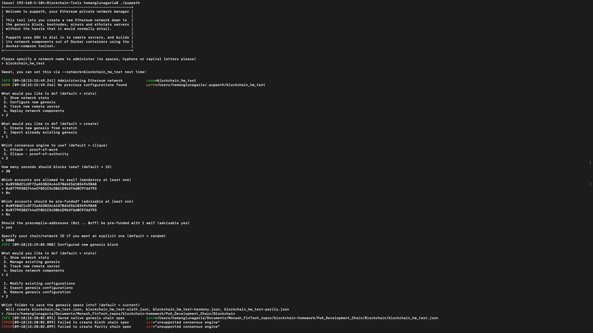
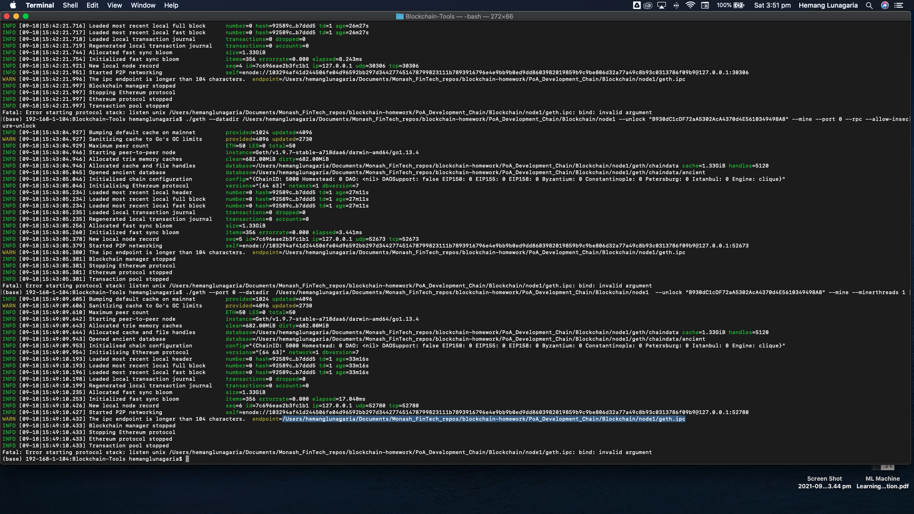
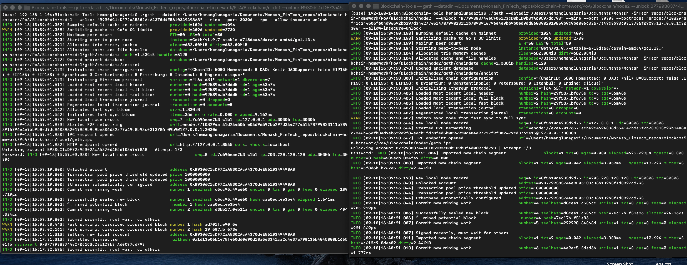
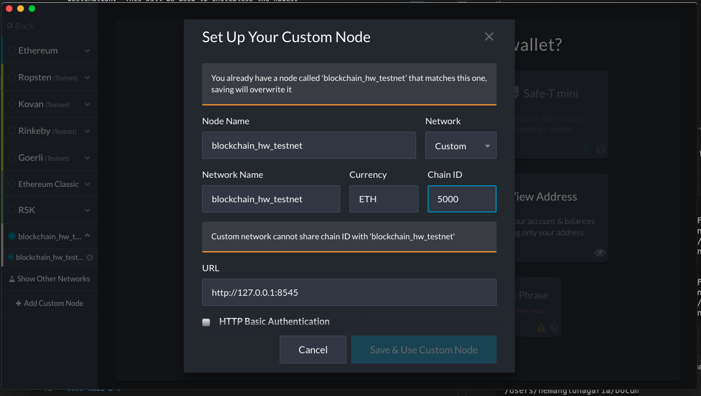
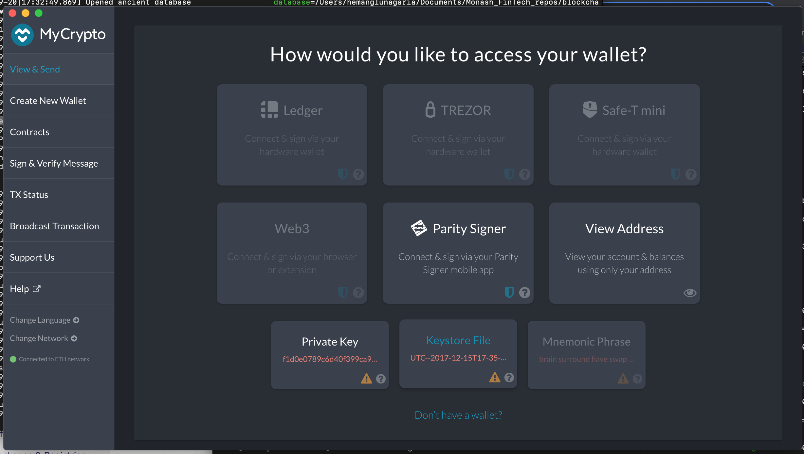
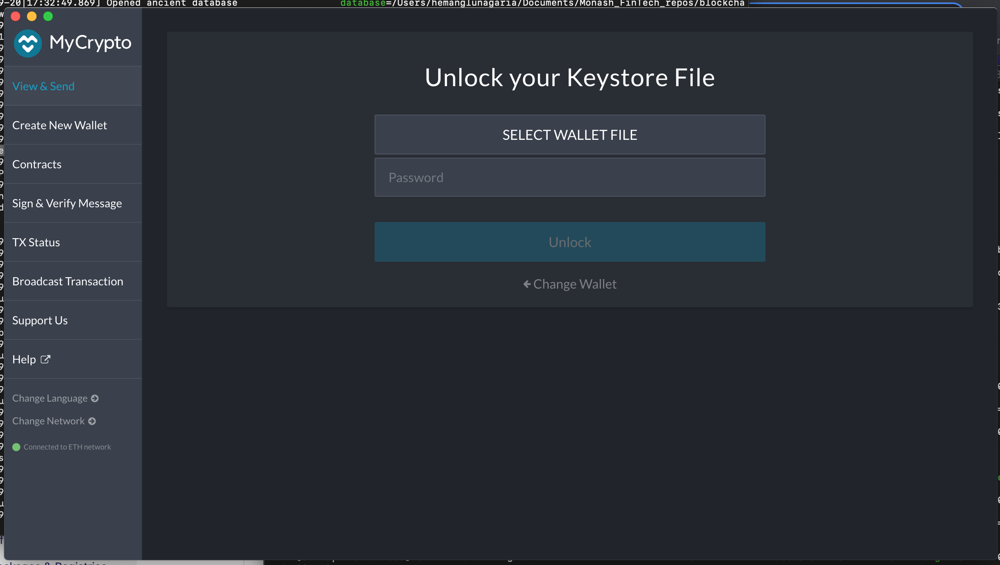
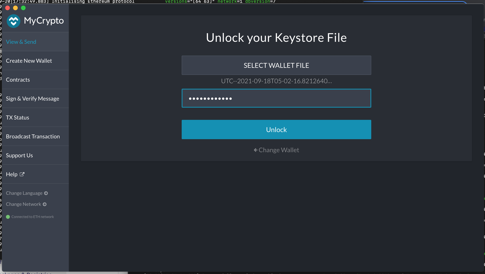
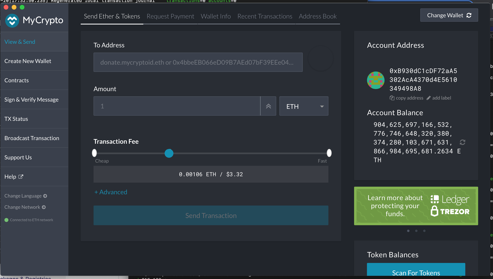
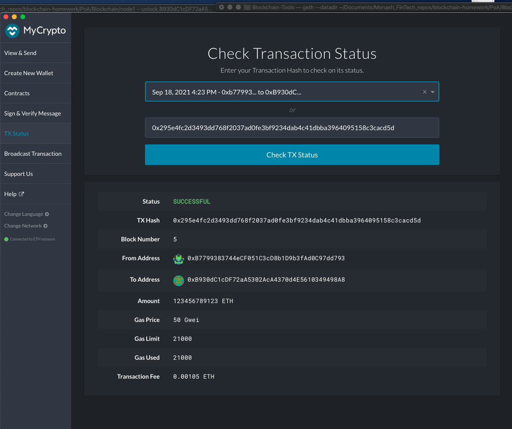

# PoA - Guide

Proof of Authority (PoA) is consensus algorithm that provides high performance and fault tolerance. In PoA, rights to generate new blocks are awarded to nodes that have proven their authority to do so. To gain this authority and a right to generate new blocks, a node must pass a preliminary authentication. This kind of consensus algorithm is used with permissioned blockchain.


## Creating PoA based Blockchaian

### Creating Nodes

#### Generate two new nodes with account addresses that will serve as authenticated sealer address

Run the following commands to create the nodes in the directory called 'PoA'

```

./geth account new --datadir /Users/hemanglunagaria/Documents/Monash_FinTech_repos/blockchain-homework/PoA/Blockchain/node1

./geth account new --datadir /Users/hemanglunagaria/Documents/Monash_FinTech_repos/blockchain-homework/PoA/Blockchain/node2

```

The commands create a keystore directory and inside of thay a keystore file that is used to open the wallet in MyCrypto wallet app.

#### Node Details

For the purpose of this homework, same password has been used to create the nodes. Password is 'BlockTestNet'

##### <b>Node1 : Public address - 0xB930dC1cDF72aA5302AcA4370d4E5610349498A8</b>
##### <b>Node2 : Public address - 0xB7799383744eCF051C3cD8b1D9b3fAd0C97dd793</b>

### Creating Blockchain

Run the following command to create the blockchain

```
./puppeth
```

Network Details:

##### <b>Network Name :  blockchain_hw_testnet</b>
##### <b>ChainID : 5000</b>



Once the blockchain is created export the genesis json file to a desired destination.  This will be used to initialise the nodes.

Run the following commands to initialise the nodes.

```
./geth init /Users/hemanglunagaria/Documents/Monash_FinTech_repos/blockchain-homework/PoA_Development_Chain/Blockchain/blockchain_hw_test.json --datadir /Users/hemanglunagaria/Documents/Monash_FinTech_repos/blockchain-homework/PoA_Development_Chain/Blockchain/node1

./geth init /Users/hemanglunagaria/Documents/Monash_FinTech_repos/blockchain-homework/PoA_Development_Chain/Blockchain/blockchain_hw_test.json --datadir /Users/hemanglunagaria/Documents/Monash_FinTech_repos/blockchain-homework/PoA_Development_Chain/Blockchain/node2
```

### Running the nodes

#### Node 1 : 

```
./geth --datadir /Users/hemanglunagaria/Documents/Monash_FinTech_repos/blockchain-homework/PoA/Blockchain/node1 --unlock "B930dC1cDF72aA5302AcA4370d4E5610349498A8" --mine --port 30306 --rpc --allow-insecure-unlock
```

Flags:

1. --datadir : Data directory for the databases and keystore
2. --unlock : Account to unlock. It can take multiple values.
3. --mine : Enable mining
4. --port :  Port on which network node is listening
5. --rpc : Enable HTTP-RPC server (deprecated and will be removed in future versions, replaced with --http)
6. --allow-insecure-unlock : Allow insecure account unlocking when account-related RPCs are exposed by http

#### Node 2 :

./geth --datadir /Users/hemanglunagaria/Documents/Monash_FinTech_repos/blockchain-homework/PoA/Blockchain/node2  --unlock "B7799383744eCF051C3cD8b1D9b3fAd0C97dd793" --mine --port 30308 --bootnodes "enode://103294af41d244506fe04d96592bb297d344277451478799823111b7893916796e4e9bb9b0ed9dd8603982019859b9c9be806d32a77a49c8b93c0313786f09b9@127.0.0.1:30306" --allow-insecure-unlock

Flags:

1. --datadir : Data directory for the databases and keystore
2. --unlock : Account to unlock. It can take multiple values.
3. --mine : Enable mining
4. --port :  Port on which network node is listening
5. --bootnodes : Comma separated enode URLs for P2P discovery bootstrap
6. --allow-insecure-unlock : Allow insecure account unlocking when account-related RPCs are exposed by http

##### Error while running  the nodes: Received the IPC endpoint is longer than 104 characters which is why renaming directory PoA_Development_Chain to PoA.



Running nodes



## Connecting the wallet

1. Open the MyCrypto app, then click Change Network at the bottom left. Click "Add Custom Node", then add the custom network information that you set in the genesis. Scroll down to choose Custom in the "Network" column to reveal more options like Chain ID. 



Please ignore the error messages as the custom network as already created and this is for demo purposes.

2. Login to account created above to see the balance.









3. Transfer the balance to another account as a test transaction. As part of testing, couple of transactions were made between the accounts that were created above.




## Resources

1. [PoA introduction](https://apla.readthedocs.io/en/latest/concepts/consensus.html)
2. [GETH Documentation](https://geth.ethereum.org/docs/interface/command-line-options)